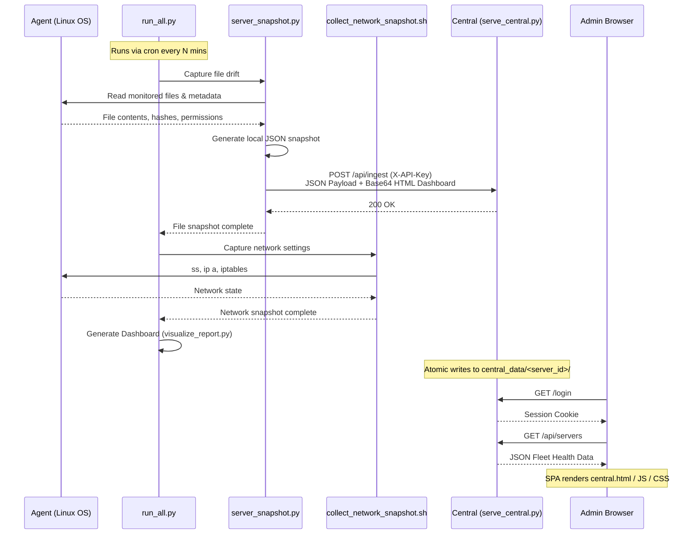

# ServerSnap Central Platform — Deployment Guide

This guide explains how to deploy the ServerSnap multi-server architecture. The platform consists of one **Central Server** (the hub) and many **Agent Servers** (the nodes being monitored).

## Architecture & Data Flow



---

## 1. Central Server Setup

The Central Server runs the fleet dashboard and receives pushes from all agents.

### Files Required
Copy the following files to your Central Server:
- `bin/serve_central.py` (Main server executable)
- `bin/public/central.html`
- `bin/public/central.css`
- `bin/public/central.js`
- `config/platform_config.json.sample`

### Step-by-Step Installation

1. **Create the deployment directory:**
   ```bash
   sudo mkdir -p /else/serversnap/bin/public
   sudo mkdir -p /else/serversnap/config
   ```

2. **Copy the files into place:**
   Copy the `bin/` and `config/` files listed above into `/else/serversnap/`.

3. **Set up configuration:**
   ```bash
   cd /else/serversnap
   cp config/platform_config.json.sample config/platform_config.json
   ```

4. **Generate a secure admin password hash:**
   ```bash
   python3 bin/serve_central.py --hash-password my_super_secret_password
   # Output will be a string like: salt_hex:hash_hex
   ```

5. **Edit the config file:**
   ```bash
   nano config/platform_config.json
   # - Set a strong, random 'api_key' (e.g. use `uuidgen`).
   # - Set a strong, random 'secret_key' (for session cookies).
   # - Paste the generated password hash into the "users" dictionary.
   ```
   > [!IMPORTANT]
   > Secure your config file so the secrets are not readable by other users:
   > `chmod 600 config/platform_config.json`

6. **Run the Central Server:**
   You can run this under `tmux`, `screen`, or a systemd service.
   ```bash
   python3 bin/serve_central.py --config config/platform_config.json &
   ```
   *The server will automatically create `central_data/` in the same directory it is run from, unless overridden in config.*

---

## 2. Agent Server Setup

The Agent Server runs the snapshot script on a schedule and pushes results to the Central Server.

### Files Required
Copy the following files to **every** Agent Server you wish to monitor:
- `bin/run_all.py` (Master orchestration script)
- `bin/server_snapshot.py` (Main monitoring script for files)
- `bin/collect_network_snapshot.sh` (Collects network/iptables state)
- `bin/visualize_report.py` (HTML dashboard generator)
- `bin/public/visualize_report.css`
- `config/config.json.sample`
- *(Optional)* `bin/serve_dashboard.py` if you still want local dashboard access.
- *(Optional)* `bin/baseline_manager.py`, `bin/change_approver.py`, `bin/approval_api.py`, `bin/report_approval_store.py` (if you use the local approval system).

### How Network Information is Collected
The platform uses the **`run_all.py`** master script to orchestrate the full snapshot lifecycle. When run, it:
1. Calls `server_snapshot.py` to capture file drift and push data to the Central Server.
2. Calls `collect_network_snapshot.sh` to gather `ss`, `ip a`, and `iptables` rules natively on Linux.
3. Calls `visualize_report.py` to bake the file drift and network info into a comprehensive HTML dashboard.

### Step-by-Step Installation

1. **Create the deployment directory:**
   ```bash
   sudo mkdir -p /else/serversnap/bin/public
   sudo mkdir -p /else/serversnap/config
   ```

2. **Copy the files into place:**
   Copy the `bin/` and `config/` files listed above into `/else/serversnap/`.

3. **Set up configuration:**
   ```bash
   cd /else/serversnap
   cp config/config.json.sample config/config.json
   ```

4. **Configure the Agent to point to Central:**
   ```bash
   nano config/config.json
   ```
   - Set `"server_id"` to something unique (e.g., `"db-server-01"`).
   - In the `"platform"` block at the bottom:
     - Set `"url"` to the Central Server's ingest URL: `"http://<central_ip>:8090/api/ingest"`
     - Set `"api_key"` to match the exact API key you configured on the Central Server.
     - Set `"push_always": true`

5. **Run the first snapshot manually:**
   ```bash
   python3 bin/run_all.py --config config/config.json
   ```
   *Verify there are no errors and that it pushes successfully to the Central Server.*

6. **Automate via Cron:**
   Run the snapshot automatically every hour (or however frequently you prefer):
   ```bash
   sudo crontab -e
   ```
   Add the following line:
   ```text
   0 * * * * cd /else/serversnap && python3 bin/run_all.py --config config/config.json
   ```

---

## 3. Viewing the Fleet Dashboard

Once your Central Server is running and agents are pushing data:
1. Open your browser and navigate to `http://<central_server_ip>:8090`.
2. Log in using the username and password you configured.
3. You will see the fleet dashboard with real-time health and change statistics!
