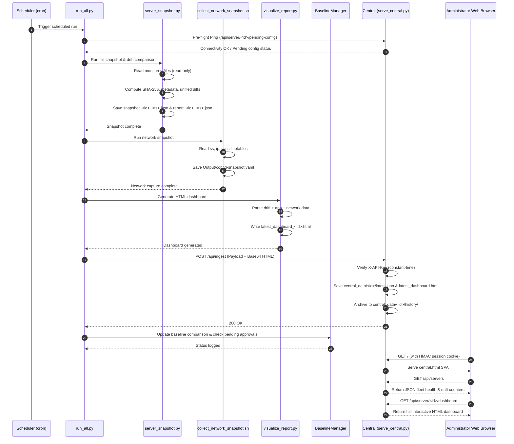

# ServerSnap — System Architecture & Data Flow

This document details the architectural topology, communication protocols, security boundaries, and data lifecycles of ServerSnap.

---

## 1. Multi-Server Architectural Topology

ServerSnap operates in a **Hub-and-Spoke (Central & Agent)** architecture.

```
+-------------------------------------------------------------------------+
|                              CENTRAL HUB                                |
|  [serve_central.py]                                                     |
|  - Ingestion API (POST /api/ingest with X-API-Key)                       |
|  - Management REST APIs (GET /api/servers, GET /api/server/<id>)         |
|  - Fleet Web UI (central.html / central.js / central.css)               |
|  - Flat Storage: central_data/<server_id>/latest.json & history/         |
+-------------------------------------------------------------------------+
          ^                              ^                         ^
          | HTTP/S POST (X-API-Key)      | HTTP/S POST             | HTTP/S POST
          | Ingestion + Dashboard HTML   |                         |
+-----------------------+   +-----------------------+   +-----------------------+
|     AGENT NODE 1      |   |     AGENT NODE 2      |   |     AGENT NODE N      |
| [run_all.py]          |   | [run_all.py]          |   | [run_all.py]          |
| - server_snapshot.py  |   | - server_snapshot.py  |   | - server_snapshot.py  |
| - collect_network.sh  |   | - collect_network.sh  |   | - collect_network.sh  |
| - visualize_report.py |   | - visualize_report.py |   | - visualize_report.py |
| - baseline_manager.py |   | - baseline_manager.py |   | - baseline_manager.py |
+-----------------------+   +-----------------------+   +-----------------------+
```

---

## 2. Component Responsibilities & Boundaries

### 2.1 Agent Node
- **Execution Model**: Periodic execution via `cron` or `systemd.timer` (e.g. every 15, 30, or 60 minutes).
- **Execution Script**: `python3 /else/serversnap/bin/run_all.py --config /else/serversnap/config/config.json`.
- **Local Isolation**: Each agent node operates completely independently. If the Central Hub is offline or unreachable, the local agent continues collecting snapshots, detecting drift, generating local HTML reports, and maintaining local baselines without interruption.
- **Push Telemetry**: Upon completing a snapshot run, the agent pushes its state (JSON snapshot, report diff, baseline diff, sanitized config, and base64-encoded HTML dashboard) to Central.

### 2.2 Central Hub
- **Execution Model**: Persistent background daemon supervised by `systemd`, `supervisord`, or `@reboot` cron.
- **Execution Script**: `python3 bin/serve_central.py --config config/platform_config.json --host 0.0.0.0 --port 8090`.
- **Zero External Database**: All server states, snapshots, diffs, and history are persisted as flat JSON files under `central_data/<server_id>/`.
- **Auto-Registration**: First push from any `server_id` initializes that server's storage hierarchy automatically.

---

## 3. End-to-End Execution Flow



---

## 4. Security & Authentication Architecture

### 4.1 Machine-to-Machine (Agent -> Central)
- **Mechanism**: HTTP header `X-API-Key: <secret>`.
- **Validation**: Constant-time string comparison (`hmac.compare_digest`) to prevent timing side-channel attacks.
- **Config Sanitization**: Before pushing config to Central, the agent strips all sensitive keys (`api_key`, `secret_key`, `users`).

### 4.2 Human-to-Machine (Browser -> Central)
- **Password Storage**: `platform_config.json` stores passwords hashed via `PBKDF2-HMAC-SHA256` with 100,000 iterations and a unique cryptographic salt.
- **Session Tokens**: Browser receives an `sscentral_session` cookie containing base64 payload signed with HMAC-SHA256 using `secret_key`.
- **Session Expiration**: Central verifies cookie timestamp against `session_timeout_seconds` on every privileged request.

### 4.3 Passive Read-Only System Boundary
- **Linux Privilege Boundary**: The application process (even when run as root for reading restricted system config files) strictly executes **READ-ONLY** operations on the host.
- **Prohibited**: No modifying system commands, no writing to `/etc`, `/sys`, `/proc`, `/boot`, `/var`, `/usr`.
- **Allowed Local Writes**: Only within application working directory (`/else/serversnap/*` or configured paths).
