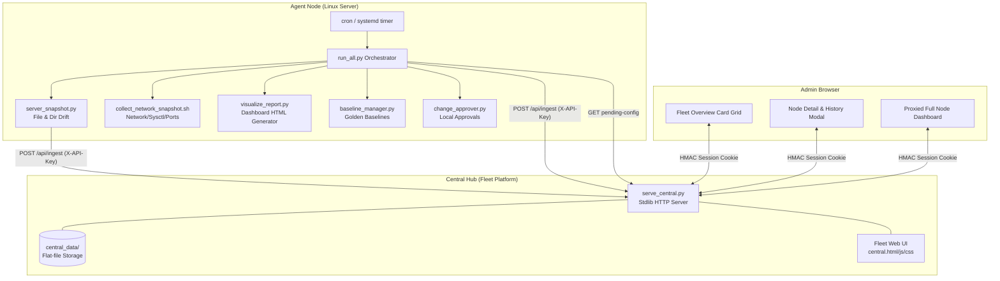

# ServerSnap — Project Memory & Feature Registry

Welcome to the **ServerSnap Project Memory**. This directory serves as the permanent, authoritative source of truth for all architectural decisions, implemented features, system invariants, configuration contracts, and preservation guidelines.

---

## 🛡️ Critical Directive for AI Agents & Developers

> [!IMPORTANT]
> **FEATURE PRESERVATION MANDATE**: When modifying or adding any feature to ServerSnap, you **MUST PRESERVE ALL EXISTING FEATURES AT ALL COSTS**.
> No refactor, enhancement, or new feature should remove, break, or degrade existing capabilities, CLI flags, API endpoints, configuration keys, or data formats.

> [!CAUTION]
> **PASSIVE USER / ZERO ROOT WRITE DIRECTIVE**: ServerSnap is a non-invasive server configuration tracking tool.
> **NO PART OF THE CODE MUST EVER WRITE AS ROOT TO MONITORED SYSTEM TARGETS.**
> Root access (if used) is strictly **READ-ONLY**. Writes are restricted solely to the application's designated storage directories (`snapshots/`, `reports/`, `baselines/`, `approvals/`, `central_data/`, `logs/`, or user-specified output directories).

---

## 📚 Memory Documents Index

| Document | Description | Key Focus Areas |
| :--- | :--- | :--- |
| **[ARCHITECTURE.md](file:///e:/Edelweiss_Projects/serversnap/MEMORY/ARCHITECTURE.md)** | End-to-end System Architecture & Data Flow | Orchestration, Agent-Central Topology, Security Model, Pipelines |
| **[FEATURES.md](file:///e:/Edelweiss_Projects/serversnap/MEMORY/FEATURES.md)** | Comprehensive Feature Catalog | Every implemented feature, CLI arguments, APIs, UI features |
| **[CONFIG_AND_STORAGE_SPEC.md](file:///e:/Edelweiss_Projects/serversnap/MEMORY/CONFIG_AND_STORAGE_SPEC.md)** | Schemas, Storage Layouts & Protocols | `config.json`, `platform_config.json`, `override.json`, Atomic I/O |
| **[INVARIANTS.md](file:///e:/Edelweiss_Projects/serversnap/MEMORY/INVARIANTS.md)** | Non-Negotiable System Invariants | Preservation rules, Regression Prevention, Code Quality Gates |

---

## 🌟 High-Level Platform Overview

ServerSnap is a lightweight, distributed, multi-server configuration drift detection and baseline management platform built using **pure Python 3 standard library** (zero external pip dependencies) and native Linux tools.



---

## 🔑 Core Design Principles

1. **Stdlib-Only Philosophy**: All Python components (`run_all.py`, `server_snapshot.py`, `serve_central.py`, `serve_dashboard.py`, `visualize_report.py`, `baseline_manager.py`, `change_approver.py`, `approval_api.py`, `audit_store.py`) must run on standard Python 3.8+ with **no external pip packages**.
2. **Stateless & Idempotent Agents**: Agents carry state only in explicit JSON snapshot files on disk. Re-running the agent on an unchanged system generates an identical snapshot and zero drift.
3. **Passive Read-Only Server Footprint**: The agent inspects files, hashes, permissions, and network state without altering system configurations or root-owned system files.
4. **Flat-File Storage**: Both local agents and the Central hub store data in clean, human-readable, and machine-parsable JSON files (`snapshots/`, `reports/`, `central_data/`). No SQL/NoSQL database installation is required.
5. **Two-Tier Authentication**:
   - Machine-to-Machine (Agent to Central): `X-API-Key` header verified with constant-time string comparison.
   - Human-to-Machine (Browser to Central/Dashboard): PBKDF2-HMAC-SHA256 salted password hashing + HMAC-SHA256 signed session cookies.
6. **Graceful Degradation**: If network collection fails or optional modules are absent, the platform logs informative warnings and continues generating drift reports without crashing.

---

## 🛠️ Quick Reference Commands

```bash
# Agent: Run full snapshot + network capture + dashboard + central push
python3 bin/run_all.py --config config/config.json

# Agent: Run file snapshot only
python3 bin/server_snapshot.py --config config/config.json -v

# Agent: Serve local dashboard
python3 bin/serve_dashboard.py --config config/config.json --port 8080

# Central: Start fleet platform hub
python3 bin/serve_central.py --config config/platform_config.json --host 0.0.0.0 --port 8090

# Central: Hash a password for platform_config.json
python3 bin/serve_central.py --hash-password "MySecretPassword123"
```
