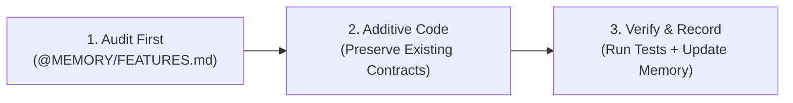

# ServerSnap — AI & Developer Usage Guide (VS Code)

How to use **`SKILLS/`** and **`MEMORY/`** in VS Code to ensure **zero feature regressions** and **zero destructive writes** during large code changes.

---

## ⚡ 1. How It Works in VS Code

| Layer | Files | How It Works |
| :--- | :--- | :--- |
| **System Rules (Automatic)** | [`AGENTS.md`](file:///e:/Edelweiss_Projects/serversnap/AGENTS.md), [`GEMINI.md`](file:///e:/Edelweiss_Projects/serversnap/GEMINI.md) | Loaded automatically on every agent prompt. Directs AI to preserve features and follow passive read-only rules. |
| **Active Skills** | [`.agents/skills/`](file:///e:/Edelweiss_Projects/serversnap/.agents/skills/) & [`SKILLS/`](file:///e:/Edelweiss_Projects/serversnap/SKILLS/) | Discovered automatically by Antigravity (`feature-preservation`, `passive-user`). Human-readable copies in `SKILLS/`. |
| **Truth Registry** | [`MEMORY/`](file:///e:/Edelweiss_Projects/serversnap/MEMORY/) | Permanent catalog of every feature, invariant, architecture flow, and storage contract. |

---

## 🎯 2. How to Use in VS Code Chat (Prompting)

### A. The `@` Mention Method (Best Practice)
When requesting a refactor, optimization, or new feature, explicitly tag the context in the chat box:
```text
@[MEMORY/FEATURES.md] @[AGENTS.md]
I want to refactor [module/file]. Preserve all existing features, CLI flags, and data schemas listed in FEATURES.md.
```

### B. The 3 Prompt Templates

#### 1. For Large Changes / Refactors:
> *"Implement [feature/change]. Consult `@MEMORY/FEATURES.md` and follow the `feature-preservation` skill. Ensure all existing CLI flags, API endpoints, and JSON schemas remain 100% backward-compatible."*

#### 2. For System Probes / Collector Scripts:
> *"Add a collector probe for [X]. Follow `@SKILLS/Passive_User/SKILL.md`. Ensure zero root writes to host OS targets and use pure Python standard library only."*

#### 3. For Post-Implementation Sync:
> *"Review `@MEMORY/FEATURES.md` and `@MEMORY/INVARIANTS.md`. Confirm no features were lost, and document the new capability in `MEMORY/FEATURES.md`."*

---

## 🔁 3. The 3-Step Safe Execution Flow



1. **Audit First**: Before generating code, ask the AI to list all existing features in the target file using `MEMORY/FEATURES.md`.
2. **Additive-Only Code**: Never delete or rename flags, JSON keys, or endpoints. Add new capabilities with default-safe fallbacks.
3. **Verify & Record**:
   - Run tests:
     ```bash
     python3 bin/test_serve_central.py
     python3 bin/test_baseline_auto_approval.py
     python3 bin/test_agent_push.py
     ```
   - Update `MEMORY/FEATURES.md` with new flags or APIs.

---

## 📌 4. Core Invariants Cheat Sheet

- ❌ **No Third-Party PIP**: Stdlib only (`urllib`, `http.server`, `hashlib`, `json`, `subprocess`).
- ❌ **Zero Root Host Writes**: Host inspections are strictly read-only (`ss`, `cat`, `ip`).
- 🔒 **Atomic Writes**: Always write to `tempfile` then `os.replace`.
- 🛡️ **Preserve CLI Flags**: Never break `--config`, `--app-dir`, `--port`, `--no-network`, `-v`.
